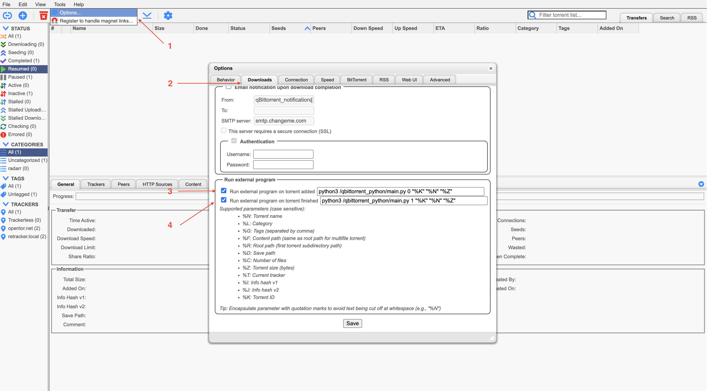

<p align="center">
   
   
   <a href="https://github.com/0xc7m/TorrentMediaHub/issues"></a>
</p>

## About

**TorrentMediaHub: Easy Setup for a Dockerized Torrent Hub with qBittorrent, Jackett, and Telegram Notifications**

If you have a problem, request, or question then please open a new issue [here](/issues).

This repository provides a streamlined, easy-to-deploy torrent hub using Docker Compose, featuring:

- **qBittorrent**: A powerful and user-friendly BitTorrent client to manage and download torrents.
- **Jackett**: An open-source indexer that enables you to access a wide variety of public and private torrent trackers by translating queries for qBittorrent.
- **Telegram Notification Bot**: Get real-time updates and notifications directly to your Telegram when torrents are added or completed.

### Features:
- **One-command deployment** with Docker Compose
- **Customizable** for various torrent trackers via Jackett
- **Telegram integration** for convenient monitoring
- **Isolated setup** using Docker containers
- **Optimized for automation** of media downloading

Perfect for those looking to set up a personal torrent server with minimal hassle!

## [Documentation](#documentation)

1. [Quick Start](#quick-start)
1. [Qbittorrent settings to enable telegram notification](#qbittorrent-settings-to-enable-telegram-notification)
1. [Telegram](#telegram)
   1. [Get Chat ID for a Private Chat](#get-chat-id-for-a-private-chat)
   1. [Get Chat ID for a Channel](#get-chat-id-for-a-channel)
   1. [Get Chat ID for a Group Chat](#get-chat-id-for-a-group-chat)

#### Quick Start

1. Clone the repository
1. Set up your `environment` in `docker-compose.yml` with necessary configurations (API keys, Telegram bot tokens, ports, etc.)
1. Run `docker-compose up -d`
1. Access the web interfaces for qBittorrent and Jackett, configure and receive Telegram notifications right away.

[Back to top &uarr;](#documentation)

#### Qbittorrent settings to enable telegram notification

```Bash
/usr/bin/python3 /qbittorrent_python/main.py 0 "%K" "%N" "%Z"
```

```Bash
/usr/bin/python3 /qbittorrent_python/main.py 1 "%K" "%N" "%Z"
```



[Back to top &uarr;](#documentation)

### Telegram 

### Get Chat ID for a Private Chat

1. Search and open our new Telegram bot
1. Click Start or send a message
1. Open this URL in a browser `https://api.telegram.org/bot{our_bot_token}/getUpdates`   
    - See we need to prefix our token with a word `bot`
    - Eg: `https://api.telegram.org/bot63xxxxxx71:AAFoxxxxn0hwA-2TVSxxxNf4c/getUpdates`
1. We will see a json like so
    ```
    {
      "ok": true,
      "result": [
        {
          "update_id": 83xxxxx35,
          "message": {
            "message_id": 2643,
            "from": {...},
            "chat": {
              "id": 21xxxxx38,
              "first_name": "...",
              "last_name": "...",
              "username": "@username",
              "type": "private"
            },
            "date": 1703062972,
            "text": "/start"
          }
        }
      ]
    }
    ```
1. Check the value of `result.0.message.chat.id`, and here is our Chat ID: `21xxxxx38`
3. Let's try to send a message: `https://api.telegram.org/bot63xxxxxx71:AAFoxxxxn0hwA-2TVSxxxNf4c/sendMessage?chat_id=21xxxxx38&text=test123`
4. When we set the bot token and chat id correctly, the message `test123` should be arrived on our Telegram bot chat.

[Back to top &uarr;](#documentation)

### Get Chat ID for a Channel

1. Add our Telegram bot into a channel
1. Send a message to the channel
1. Open this URL `https://api.telegram.org/bot{our_bot_token}/getUpdates`
1. We will see a json like so
    ```
    {
      "ok": true,
      "result": [
        {
          "update_id": 838xxxx36,
          "channel_post": {...},
            "chat": {
              "id": -1001xxxxxx062,
              "title": "....",
              "type": "channel"
            },
            "date": 1703065989,
            "text": "test"
          }
        }
      ]
    }
    ```
1. Check the value of `result.0.channel_post.chat.id`, and here is our Chat ID: `-1001xxxxxx062`
1. Let's try to send a message: `https://api.telegram.org/bot63xxxxxx71:AAFoxxxxn0hwA-2TVSxxxNf4c/sendMessage?chat_id=-1001xxxxxx062&text=test123`
1. When we set the bot token and chat id correctly, the message `test123` should be arrived on our Telegram channel.

[Back to top &uarr;](#documentation)

### Get Chat ID for a Group Chat

The easiest way to get a group chat ID is through a Telegram desktop application.

1. Open Telegram in a desktop app
1. Add our Telegram bot into a chat group
1. Send a message to the chat group
1. Right click on the message and click `Copy Message Link`
    - We will get a link like so: `https://t.me/c/194xxxx987/11/13`
    - The pattern: `https://t.me/c/{group_chat_id}/{group_topic_id}/{message_id}`
    - So here is our Chat ID: `194xxxx987`
1. To use the group chat ID in the API, we need to prefix it with the number `-100`, like so: `-100194xxxx987`
1. Now let's try to send a message: `https://api.telegram.org/bot63xxxxxx71:AAFoxxxxn0hwA-2TVSxxxNf4c/sendMessage?chat_id=-100194xxxx987&text=test123`
1. When we set the bot token and chat id correctly, the message `test123` should be arrived on our group chat.

[Back to top &uarr;](#documentation)

## Contributing

- [Contributing](/CONTRIBUTING.md)

## Developers

- [0xc7m](https://github.com/0xc7m)

## References

- qBittorrent - https://github.com/qbittorrent/qBittorrent
- Jackett - https://github.com/Jackett/Jackett
- Telegram bots - https://core.telegram.org/bots/tutorial
- Telegram chat id - https://stackoverflow.com/questions/32423837/telegram-bot-how-to-get-a-group-chat-id#32572159
- Telegram markdown - https://sourceforge.net/p/telegram/wiki/markdown_syntax/

## License

Project is distributed under the [GPL-3.0 license](/LICENSE).